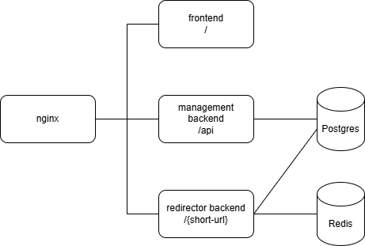

# System Design

Design a URL Shortener

Definition of URL Shortener: 
- User input with original URL(e.g. https://github.com/jjteoh-thewebdev/url-shortener/tree/main), the program need to output a short url(e.g. https://short.url/xyz). 
- When user browse the short url, the program need to redirect user to the long url.

Purpose of short url:
- Cleaner and professional look when attach in email, posting on social media, printing on printed materials.
- Tracking & Analytics

## Functional Requirement

- Generate a short url from long url(original url)
- Short Url should redirect to long url
- Set expiry date
- Set password protection - for simplicity, infinite attempts for incorrect password
- Simple click count tracker - don't have to track visitor's user agent, IP, device, event time and etc. As long as the short url is requested, we increase the count.

## Non-functional Requirement

- Availability - should be up and runnning all the time
- Reliability - should redirect to long url as fast as possible(within seconds)
- Scalability
- Faul Tolerance


## Out of scope

- User management - no sign up/log in required
- API Security - no API Key required
- Complex tracking and analytics (i.e visitor's user agent, IP, device, event time and etc)
- Lockdown after several password attempts failed.

## Assumptions

(Most of it from Alex Xu's System Design Inteview Volume 1)

1. Short URL Length - as short as possible
2. Whitelist Characters - numbers(0-9), characcters(a-z, A-Z)
3. Update or Delete - no (since user management is out of scope)
4. Traffic Volume - 100 million URLs are generated per day

    - Write operation: 100 million URLs are generated per day
    - Write operation per second: 100 million / 24 / 3600 = 1160
    - Read operation per second: read:write ratio 10:1, 1160 * 10 = 11,600
5. Storage Requirement - Software lifespan of 10 years: 100mil * 365 * 10 = 365 bil records
    - assume avg url length = 100 bytes
    - storage requirements for 10 years: 365 bil * 100 bytes * 10 years = 365 TB


## API Endpoints

We will need:
- POST /api/v1/urls/shorten     - url shortening
- GET /{short-url}              - url redirection
- POST /{short-url}             - url redirection for password-protected route

### POST /api/v1/urls/shorten

*Description*

Accept long url and generate short url.

*Request Body*
```json
{
    "long_url": string,
    "expiry": date, // optional
    "password": string, // optional
    "custom_url": string // optional
}
```

*Response*

success case
```json
// HTTP 200 OK
{
    "error": null, 
    "data": { 
        "short_url": string
    }
}
```

failed case
```json
// HTTP 400 Bad Request or 500 Internal Server Error 
{
    "error": string,
    "data": null
}

```

### GET /{short-url}

*Description*

Redirect to long url.

*Path Params*

```json
short-url: string
```

*Response*

success case
```json
HTTP 302 Moved Temporarily
```

not found case
```json
// HTTP 404 NOT FOUND
{
    "error": "requested url not found.",
    "data": null
}
```

password-protected case
```json
HTML with password prompt will be returned
```

expired short url
```json
// HTTP 400 BAD REQUEST
{
    "error": "requested url already expired.",
    "data": null
}
```


### POST /{short-url}

*Description*

Redirect to long url(for password protected short url).

*Request Body*
```json
// HTTP 200
{
    "password": string
}
```

*Response Body*

success case
```json
HTTP 302 Moved Temporarily
```

not found case
```json
// HTTP 404 NOT FOUND
{
    "error": "requested url not found.",
    "data": null
}
```

invalid password
```json
// HTTP 401 Unauthorized
{
    "error": "Invalid credentials",
    "data": null
}
```

expired short url
```json
// HTTP 400 BAD REQUEST
{
    "error": "requested url already expired.",
    "data": null
}
```


#### Why 302 Moved Temporarily instead of 301 Moved Permanently

Both are used for redirection. However, 301 indicates that the requested URL is permenantly moved to the long URL. This, the browser caches the response and subsequent requests for the same URL will be forwarded automatically without sending to our URL shortener. On the other hand, 302 indicates temporarily moved to long URL, thus, browser will send requests to URL shorterner all the time. Since, we want to capture the visit count, 302 is more appropriate for our usecase.


## Architecture Overview

<div align="center">
    
</div>

Components:
- `nginx` acts as reverse-proxy, ingress control
- `frontend` app built with Next.js
- `management backend` api server(Express.js) for handling creation of urls in Postgres DB
- `redirector backend` backend server(Fastify) for handling redirection, optimized for speed
- `postgres` - store urls 
- `redis` - cache recently visited urls
- `Kubernetes` - Load balancing, failover, self-healing pods, pod autoscaler
- *`Observability` - (may not implement) monitor apps, collect metrics and logs

## Algo: Short URL Design

#### 1. Whitelist Characters

possible characters = [0-9,a-z,A-Z], 10 + 26 + 26 = 62 possible characters.


#### 2. Deciding the short-url length

From previous section, we calculated estimated urls needed to generate in 10 years of software lifespan: 365 bil records.

Given possible characters = 62
number of records = 365 bil.

We can derive to equation:
```
62^n >= 365bil.
```

if n = 6
```
62^6 = ~56mil.
```

if n = 7
```
62^7 = ~3.5tril.
```

Thus, short-url with 7 character long is fair enough for 10 years data.

#### base62 encoding

This is a technique to convert number to a different number representation systems. In our case, we will be converting numbers in base10 to base62.

```
Conversion mapping:
base10:   0 1 2 ...         9 10 11 ...       36 37 ...              61
base62:   0 1 2 ...         9 A  B ...        a  b  ...              z
```

For example, 

```
given: 1234567

Step	Number	÷ 62	Quotient	Remainder	Base62 Representation
1	    1234567	/62	    19912	    23	        N
2	    19912	/62	    321	        50	        o
3	    321	/62     	5	        11  	    B
4	    5	/62	        0	        5	        5

combine the base62 representation reversely, we get:
base62 = 5BoN

```

For the input(base10), we will leverage the `auto-increment` feature in Postgres to generate id in number. Then, we apply `unique index` to the shortUrl daat column to avoid collision.


## Data Model

### URL

```json

urls
------
PK  | id            | bigint
    | shortUrl      | string, unique
    | longUrl       | string
    | passwordHash  | string
    | visitorCount  | bigint
    | expiredAt     | datetime
    | createdAt     | datetime
```

Keynote:

- In Postgres, `bigint` can support up to ~9.2 quintillion while `integer` can store up to ~2.1 billion records.
- `bigint` for `id` as we want to cater 365 billion of records over 10 years
- `bigint` for `visitorCount` as 11,600 read per seconds * 60min * 24hr * 365day * 10yr = ~60 bils
- `passwordHash` is the masked value of password, do not store password as plain text in data store.


## Scaling Up
- kubernetes

## Cache Strategy
- Redis string
    - key: short-url, value: json string of url object
    - Least Recently Used (LRU)

## Load Balancing